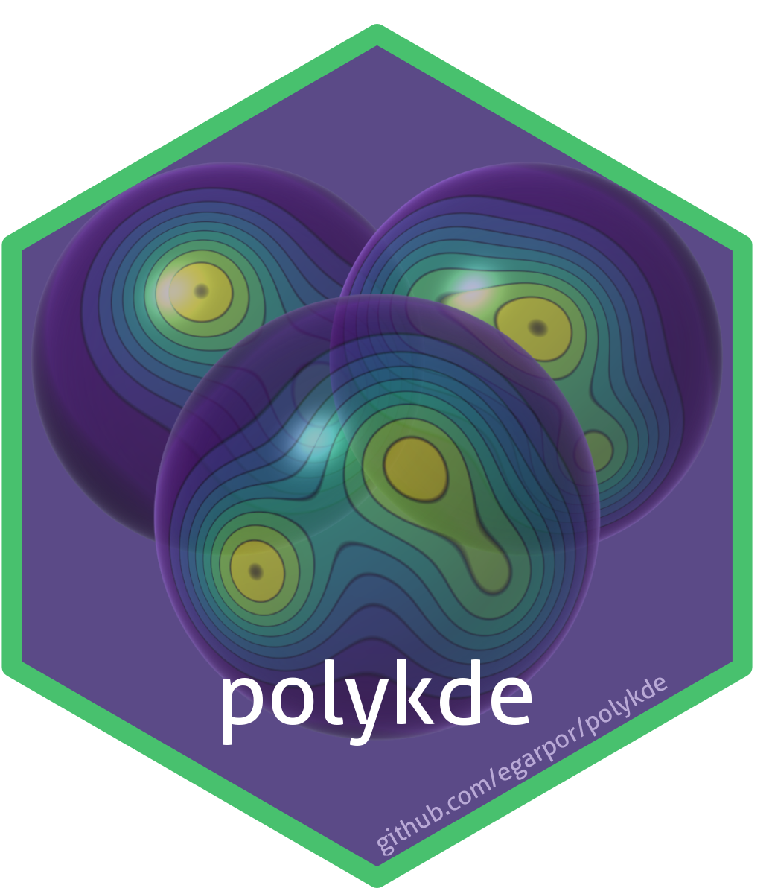
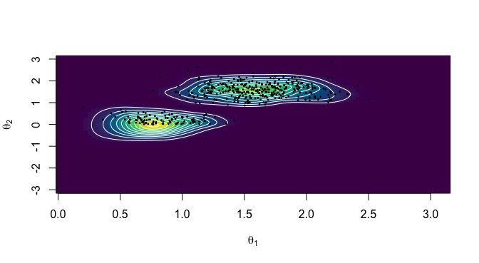
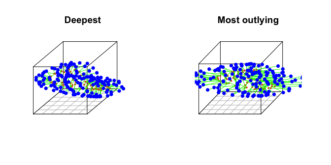

# polykde 

[](https://www.gnu.org/licenses/gpl-3.0)
[](https://github.com/egarpor/polykde/actions)
[](https://github.com/egarpor/polykde/actions)
[](https://app.codecov.io/gh/egarpor/polykde)
[](https://cran.r-project.org/package=polykde)
[](https://cran.r-project.org/package=polykde)
[](https://cran.r-project.org/package=polykde)

## Overview

Companion package for the article *Kernel density estimation with
polyspherical data and its applications* (García-Portugués and
Meilán-Vila, 2025).

## Installation

``` r
# Install it from CRAN
install.packages("polykde")
library(polykde)
```

``` r
# Alternatively, from GitHub
library(pak)
pak("egarpor/polykde")
library(polykde)
```

## Usage

A sample on the polysphere
$`\mathbb{S}^{d_1}\times\cdots\times\mathbb{S}^{d_r}`$ is stored as a
matrix of size `c(n, sum(d) + r)` whose rows concatenate the $`r`$
unit-norm blocks. Everything in `polykde` — density estimation,
bandwidth selection, regression, ridges, and tests — takes that matrix
plus the vector `d` of dimensions.

### Density estimation on the sphere

``` r
set.seed(423432)

# A two-component von Mises--Fisher mixture on S^2
d <- 2
X <- r_mvmf_polysph(n = 500, d = d, mu = rbind(c(0, 0, 1), c(1, 1, 0) / sqrt(2)),
                    kappa = rbind(10, 25), prop = c(0.6, 0.4))

# Bandwidth selection: rule of thumb and likelihood cross-validation
bw_rot_polysph(X = X, d = d)$bw
#> [1] 0.2122832
h <- bw_cv_polysph(X = X, d = d, type = "LCV")$bw
h
#> [1] 0.1344959

# Evaluate the kernel density estimator on a grid of spherical angles, with
# theta_1 the polar angle and theta_2 the azimuth
th_1 <- seq(0, pi, l = 100)
th_2 <- seq(-pi, pi, l = 200)
grid <- angles_to_sph(theta = as.matrix(expand.grid(th_1, th_2)))
kde <- matrix(kde_polysph(x = grid, X = X, d = d, h = h), nrow = length(th_1))

# Density surface with the sample superimposed
image(th_1, th_2, kde, col = hcl.colors(50, "Viridis"), useRaster = TRUE,
      xlab = expression(theta[1]), ylab = expression(theta[2]))
contour(th_1, th_2, kde, add = TRUE, col = "white", drawlabels = FALSE)
points(sph_to_angles(x = X), pch = 16, cex = 0.4)
```



### Polyspherical data

``` r
set.seed(423432)

# A product of von Mises--Fisher distributions on S^1 x S^2: the r = 2 blocks
# of unit vectors are concatenated by columns
d <- c(1, 2)
mu <- c(0, 1, 0, 0, 1)
kappa <- c(5, 10)
X <- r_vmf_polysph(n = 200, d = d, mu = mu, kappa = kappa)
dim(X)
#> [1] 200   5

# The 0-based indexes delimiting the sphere blocks: columns 1:2 and 3:5
comp_ind_dj(d = d)
#> [1] 0 2 5

# Least squares cross-validation, with the exact loss for the vMF kernel
h <- bw_cv_polysph(X = X, d = d, type = "LSCV", exact_vmf = TRUE)$bw
h
#> [1] 0.1240745 0.1674424

# The estimator tracks the true density over the sample
cor(kde_polysph(x = X, X = X, d = d, h = h),
    d_vmf_polysph(x = X, d = d, mu = mu, kappa = kappa))
#>           [,1]
#> [1,] 0.9059769
```

### Homogeneity tests

``` r
set.seed(423432)

# Two samples on S^2 from the same distribution
n <- c(100, 100)
X1 <- r_vmf_polysph(n = n[1], d = 2, mu = c(0, 0, 1), kappa = 5)
X2 <- r_vmf_polysph(n = n[2], d = 2, mu = c(0, 0, 1), kappa = 5)
hom_test_polysph(X = rbind(X1, X2), d = 2, labels = rep(1:2, times = n),
                 type = "jsd", h = 0.5, B = 500, show_prog = FALSE)
#> 
#>  Permutation-based Jensen--Shannon distance test of homogeneity
#> 
#> data:  rbind(X1, X2)
#> Tn = -0.0041028, p-value = 0.6307
#> alternative hypothesis: any alternative to homogeneity

# Now the second sample is more concentrated
X2 <- r_vmf_polysph(n = n[2], d = 2, mu = c(0, 0, 1), kappa = 20)
hom_test_polysph(X = rbind(X1, X2), d = 2, labels = rep(1:2, times = n),
                 type = "jsd", h = 0.5, B = 500, show_prog = FALSE)
#> 
#>  Permutation-based Jensen--Shannon distance test of homogeneity
#> 
#> data:  rbind(X1, X2)
#> Tn = 0.036579, p-value = 0.001996
#> alternative hypothesis: any alternative to homogeneity
```

## Data application in hippocampus shape analysis

The `hippocampus` dataset holds skeletal representations (s-reps) of the
hippocampi of 177 6-month-old infants, 34 of whom later developed
autism. Each s-rep has 168 spokes, so the spoke directions of a subject
form a point on $`(\mathbb{S}^2)^{168}`$.

``` r
# Put the spoke directions in the c(n, sum(d) + r) layout
data("hippocampus")
dirs <- hippocampus$dirs
r <- ncol(dirs)
d <- rep(2, r)
X <- do.call(cbind, args = lapply(1:r, function(i) dirs[, i, ]))
dim(X)
#> [1] 177 504

# Rule-of-thumb bandwidths for the spherically symmetric softplus kernel
h_mrot <- bw_mrot_polysph(X = X, d = d, kernel = 3, k = 100)
h_rot <- bw_rot_polysph(X = X, d = d, bw0 = 2^(-1:2) %o% h_mrot,
                        kernel = 3, kernel_type = 2, k = 100)$bw

# Leave-one-out log-densities act as a depth: the largest one flags the most
# representative hippocampus, the smallest one the most outlying
log_dens <- log_cv_kde_polysph(X = X, d = d, h = h_rot, wrt_unif = TRUE,
                               kernel = 3, kernel_type = 2, k = 100)
deep <- which.max(log_dens)
outly <- which.min(log_dens)
c("deepest" = deep, "most outlying" = outly)
#>       deepest most outlying 
#>           156           137
```

``` r
par(mfrow = c(1, 2))
titles <- c("Deepest", "Most outlying")
for (j in 1:2) {

  i <- c(deep, outly)[j]
  view_srep(base = hippocampus$base[i, , ], dirs = dirs[i, , ],
            bdry = hippocampus$bdry[i, , ], static = TRUE, main = titles[j])

}
```



Testing the homogeneity of the spoke directions of the two diagnostic
groups gives a p-value near the 5% level. The paper below uses `B = 5e3`
permutations, rather than the `B = 100` used here to keep the README
quick to build.

``` r
set.seed(423432)
hom_test_polysph(X = X, d = d, labels = hippocampus$ids_labs, type = "jsd",
                 h = 4 * h_rot, kernel = 3, kernel_type = 2, k = 100,
                 B = 100, show_prog = FALSE)
#> 
#>  Permutation-based Jensen--Shannon distance test of homogeneity
#> 
#> data:  X
#> Tn = 0.0015581, p-value = 0.08911
#> alternative hypothesis: any alternative to homogeneity
```

The vignette `vignette("polykde")` gives a fuller tour, covering kernels
and their efficiencies, samplers, kernel regression, and density ridge
estimation.

## Replicability

The folder `/replication` contains the scripts to replicate the
numerical experiments and real data application of the paper and its
Supplementary Material (SM):

- The script `kde-sims.R` reproduces the asymptotic normality experiment
  (Figures 5–8 in the SM).
- The script `kde-effic.R` computes the kernel efficiency table (Table 1
  in the SM) and the kernel and kernel efficiency graphs (Figure 1 in
  the paper).
- The scripts `jsd-sims-k2-S2.R`, `jsd-sims-hippo.R`, and
  `jsd-sims-k3-S10^2.R` reproduce two simulation experiments for the
  $`k`$-sample test in (Figures 9–12 in the SM).
- The scripts `kde-spoke-dirs.R` and `test-spoke-dirs.R` reproduce the
  real data application on the hippocampus shape analysis (Figure 3 in
  the paper and Figure 13 in the SM, and Figure 4 in the paper,
  respectively).

## References

García-Portugués, E. and Meilán-Vila, A. (2026). Kernel density
estimation with polyspherical data and its applications. *Journal of the
American Statistical Association*, 121(553):427–439.
[doi:10.1080/01621459.2025.2521898](https://doi.org/10.1080/01621459.2025.2521898).

García-Portugués, E. and Meilán-Vila, A. (2023). Hippocampus shape
analysis via skeletal models and kernel smoothing. In Larriba, Y. (Ed.),
*Statistical Methods at the Forefront of Biomedical Advances*,
pp. 63–82. Springer, Cham.
[doi:10.1007/978-3-031-32729-2_4](https://doi.org/10.1007/978-3-031-32729-2_4).
